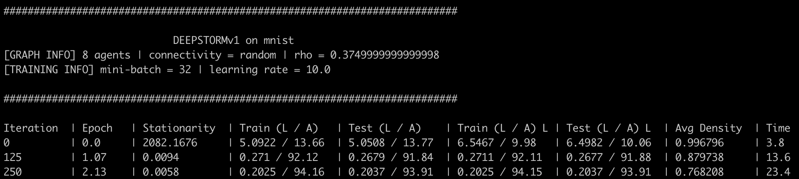

# DEEPSTORM
---

This document provides instructions on how to reproduce the experimental results from ["Proximal Stochastic Recursive Momentum Methods for Nonconvex Composite Decentralized Optimization"](). Covered in this document is:

- package requirements utilized in the experiments
- instructions on how to reproduce the results from the paper (i.e. hyperparameter settings, etc.)
- a description of the main components in this repository, their use, and how to modify them for new use cases

## Experiment set-up
---

Experiments were ran on clusters of 8 NVIDIA Tesla V100's (each with 32 GiB HBM) connected by dual 100 Gb EDR Infiniband. The operating system utilized is [CentOS](https://www.centos.org) 7 and all experiments are ran within a conda version 4.9.2 environment. All code is written in Python version 3.7.9, using `PyTorch` version 1.6.0 with CUDA version 10.2; for instructions on how to install PyTorch with CUDA see [here](https://pytorch.org/get-started/previous-versions/). The GCC version of the system utilized is 4.8.5. To perform neighbor communication, `mpi4py` was utilized; see [here](https://mpi4py.readthedocs.io/en/stable/install.html) for instructions on how to install this package.

A complete list of packages necessary for completing the experiments is located in the [requirements.txt](requirements.txt) file. Comprehensive installation instructions can be found in [Install.md](Install.md).


## Running experiments
---

For sake of example, we will use `deepstormv1.py` as our test method here; see the `methods` folder for the other methods utilized in the experiments

1. Navigate to this repository from the terminal/command line and move desired method out of `methods` folder

For sake of organization, the actual methods utilized in the experiments are delegated to the `methods` folder. Move them into the root directory (i.e. here) via, e.g.:

```
mv methods/deepstormv1.py .
```

2. Activate your Conda environment

```
conda activate <your_environments_name>
```

3. Run experiments using the parameters listed below for each method/dataset combination

Each method contains several parameters, either specific to the algorithm (e.g. learning rate, batch size, etc.) or related to training specifications (e.g. dataset, algorithm iterations, when to compute training/testing loss/accuracy, etc.); the global (i.e. used by all methods) settings for each dataset can be found in the following table:

| Dataset | Parameters |
| :--- | :--- |
| a9a | `--data='a9a' --updates=10001 --report=100 --l1=1e-4` |
| miniboone | `--data='miniboone' --updates=10001 --report=100 --l1=1e-4` |
| MNIST | `--data='mnist' --updates=25001 --report=125 --l1=1e-4` |


For a full list of required parameters specific to each method, refer to the following table:

| Method | Dataset | Parameters |
| :--- | :--- | :--- |
| `deepstormv1.py` | a9a | `--init_batch=1 --mini_batch=32 --comm_pattern='ladder' --step_type='diminishing' --k0=7 --beta=0.153 --lr=5.0` |
|  | miniboone | `--init_batch=1 --mini_batch=64 --comm_pattern='ladder' --step_type='diminishing' --k0=5 --beta=0.031 --lr=10.0` |
|  | MNIST | `--init_batch=1 --mini_batch=32 --comm_pattern='ladder' --step_type='diminishing' --k0=3 --beta=0.0228 --lr=10.0` |
| `deepstormv2.py` | a9a | `--init_batch=1 --mini_batch=128 --comm_pattern='ring' --step_type='diminishing' --k0=5 --beta=0.031 --lr=10.0` |
|  | miniboone | `--init_batch=1 --mini_batch=64 --comm_pattern='ladder' --step_type='diminishing' --k0=5 --beta=0.031 --lr=10.0` |
|  | MNIST | `--init_batch=1 --mini_batch=64 --comm_pattern='random' --step_type='diminishing'  --k0=3 --beta=0.0228 --lr=10.0` |
| `deepstormv1svrg.py` | a9a | `--init_batch=1 --mini_batch=32 --comm_pattern='ladder' --step_type='diminishing' --k0=7 --beta=0.153 --lr=5.0 --snapshot=256 --snap_size=128` |
|  | miniboone | `--init_batch=1 --mini_batch=64 --comm_pattern='ring' --step_type='diminishing' --k0=5 --beta=0.031 --lr=10.0 --snapshot=400 --snap_size=98` |
|  | MNIST | `--init_batch=1 --mini_batch=32 --comm_pattern='random' --step_type='diminishing'  --k0=3 --beta=0.0228 --snapshot=118 --snap_size=24` |
| `dsgt.py` | a9a | `--mini_batch=64 --comm_pattern='ladder' --step_type='diminishing' --lr=1.0` |
|  | miniboone | `--mini_batch=128 --comm_pattern='ring' --step_type='diminishing' --lr=1.0` |
|  | MNIST | `--mini_batch=64 --comm_pattern='ladder' --step_type='diminishing' --lr=10.0` |
| `proxgtsr.py` | a9a | `--mini_batch=64 --full_grad=32 --comm_pattern='ladder' --lr=5e-3` |
|  | miniboone | `--mini_batch=128 --full_grad=32 --comm_pattern='ring' --lr=5e-3` |
|  | MNIST | `--mini_batch=64 --full_grad=64 --comm_pattern='random' --lr=1e-2` |
| `sppdm.py` | a9a | `--mini_batch=512 --comm_pattern='ladder' --c=1.0 --kappa=0.1 --gamma=3 --beta=0.9 --mom='nesterov' --alpha=0.01` |
|  | miniboone | `--mini_batch=1024 --comm_pattern='ring' --c=1.0 --kappa=0.1 --gamma=3 --beta=0.9 --mom='nesterov' --alpha=0.01` |
|  | MNIST | `--mini_batch=128 --comm_pattern='random' --c=1.0 --kappa=0.1 --gamma=3 --beta=0.9 --mom='nesterov' --alpha=0.1` |


So a full example for running `deepstormv1.py` on the MNIST dataset over the random communication graph is given by:

```
mpirun -np 8 python deepstormv1.py --data='mnist' --updates=25001 --report=125 --l1=1e-4 --comm_pattern='random' --init_batch=1 --mini_batch=32 --step_type='diminishing' --k0=3 --beta=0.0228 --lr=10.0
```

If the code is working properly, you will see output that looks like:



4. Reproduce the results from the paper by varying over all initializations

Append `--trial=i` for `i=1,2,...,10` to the above code to record outputs across different initializations (MNIST results come from the *odd* trials: 1, 3, 5, 7, 9)

5. Aggregate results are posted in the `results` folder here (by aggregate, we mean averaged over the trials used in the paper to produce the figures and tables)


## Repository summary
---
This repository contains the following directories and files:
```
data/
helpers/
init_weights/
mixing_matrices/
methods/
models/
results/
requirements.txt
```

#### data
The `data` folder contains subfolders housing the training/testing data used in the experiments. To add a new dataset, include the folders here and modify lines containing `torch.utils.data.DataLoader` in the corresponding methods file

#### helpers
The `helpers` folder contains helper functions utilized by all methods. These are:

1. `replace_weights.py`: a custom PyTorch optimizer that simply _replaces_ model parameters from a LIST of PyTorch tensors; since all methods update many different variables, this is a straightforward way to minimize conflicts when updating model parameters. The `.step()` method requires two parameters:
    - `weights`: a LIST of PyTorch tensors of length `k` where `k` represents the number of model parameters
    - `device`: the torch device (i.e. GPU) the model is saved on

2. `l1_regularizer.py`: performs soft-thresholding of the weights in a LIST of PyTorch tensors via the `.forward()` method. Additionally, with the `.number_non_zeros()` method, we count the number of non-zero elements (up to error tolerance `1e-6`) in a LIST of PyTorch tensors

3. `custom_data_loader.py`: loads the a9a and MiniBooNE datasets from their tensor files in the proper format

#### mixing_matrices
The `mixing_matrices` folder contains `Numpy` arrays of size `N x N` where each `(i,j)` entry corresponds to agent `i`'s weighting of agent `j`'s information

To run experiments with different weight matrices/communication patterns or sizes, save the corresponding mixing matrix in this directory

#### init_weights
The `init_weights` directory contains the initial parameters for each agent, for each random seed, used in the experiments. These are only uploaded for sake of completeness; to remove the need to save initial weights for future experiments, comment lines containing
```
[torch.tensor(init_weights[i]).to(self.device) for i in range(len(init_weights))]
```
and replace with
```
[p.data.detach().clone() for p in self.model.parameters()]
```

#### models
The `models` folder contains the neural network architectures used in the experiments

#### methods
The `methods` folder contains all of the different decentralized optimization methods compared in this work; see the paper for a list of those compared here
